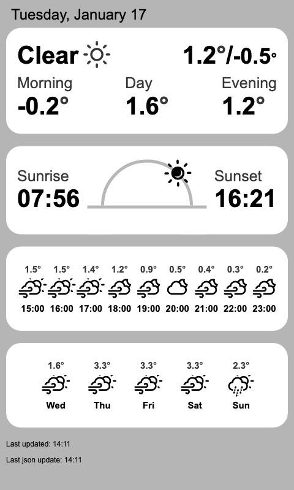

Most of the code for this part of the project was forked from:
https://github.com/makepanic/eink-weather

A small html snippet that allows the generation of a weather dashboard for display on an e-ink display.

## Configuration

* This project requires the following environment variables to be set:
    * `LAT` - a latitude
    * `LON` - a longitude
    * `OPENWEATHER_KEY` - a valid [OpenWeather](https://openweathermap.org/api) api key

## Installation

* ensure [GraphicsMagick](http://www.graphicsmagick.org/) is installed 
    * This is required to convert the screenshot to black and white and rotate it
* install dependencies
* start a http server (e.g. `python3 -m http.server 9999`), or use pm2: `pm2 serve --port 9999 --name weather-page`
* run `node scrot.js` to take a screenshot of the html page, automaded using cron: `*/15 * * * * cd ~/Repos/eink-weather-apps && /usr/bin/node scrot.js >> ~/Repos/eink-weather-apps/scrot.log 2>&1`
* upload the generated screenshot to the eink display, see code in [link to code]

## Screenshot

| Name  | Screenshot |
| ------------- | ------------- |
| Rendered output  |   |

